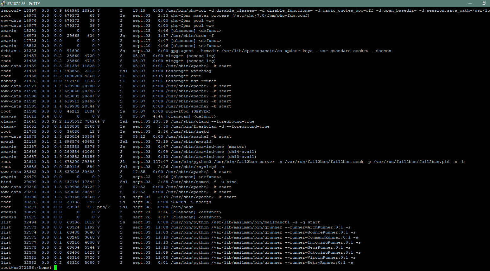
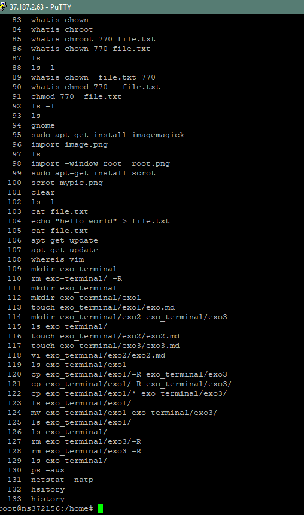
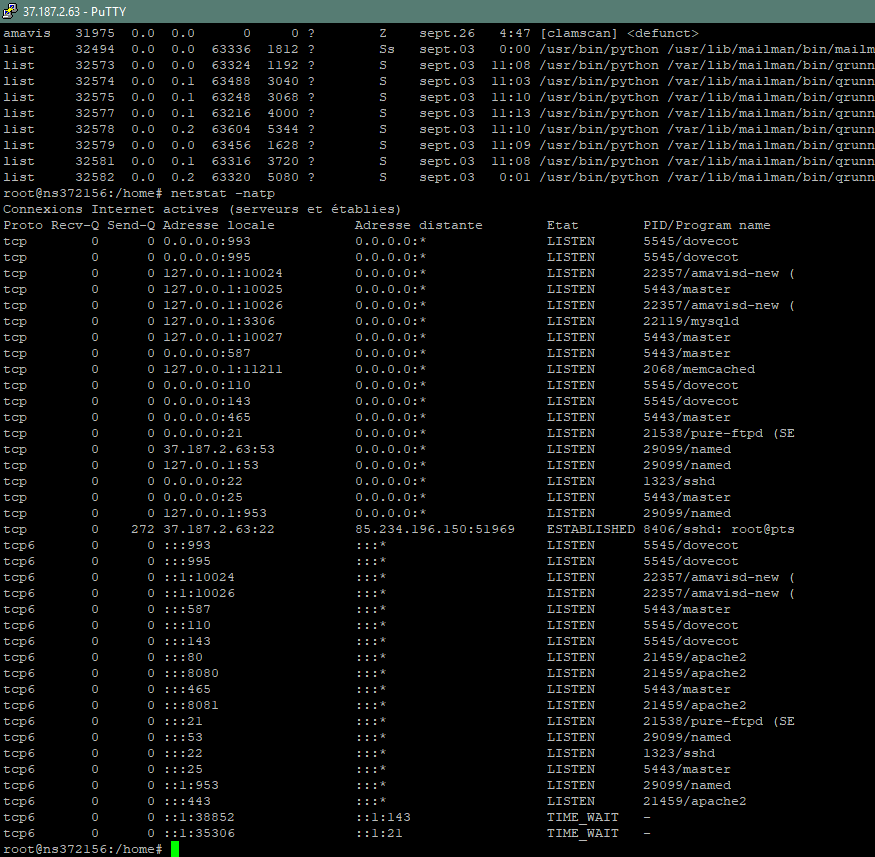
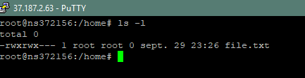

# check

* whoami affiche le nom de l'usager courant
* pwd affiche le dossier courant
* chown change le propriétaire et le groupe d'un fichier ou dossier
* clear replace la ligne de commande en haut de l'écran

